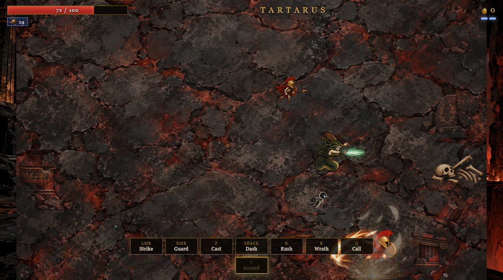
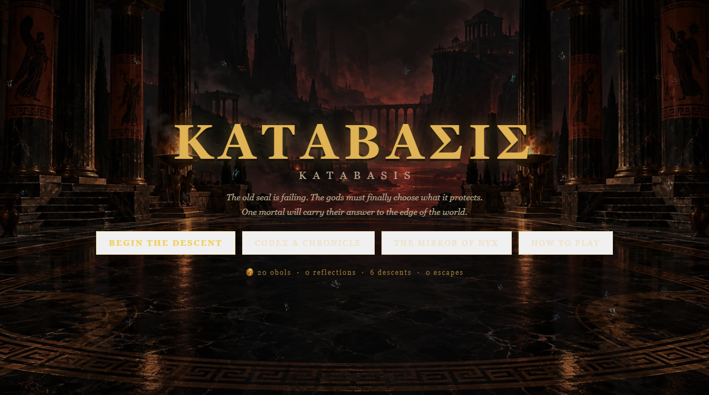
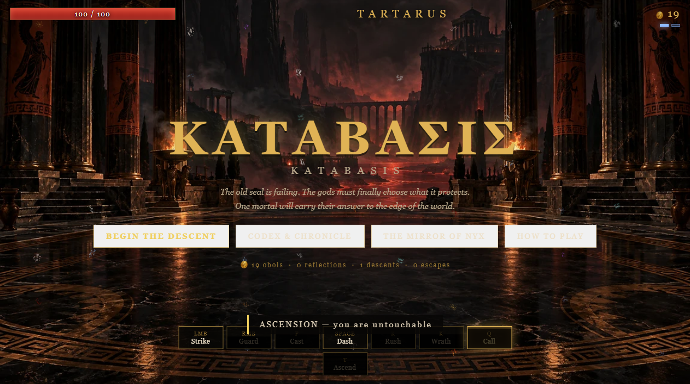
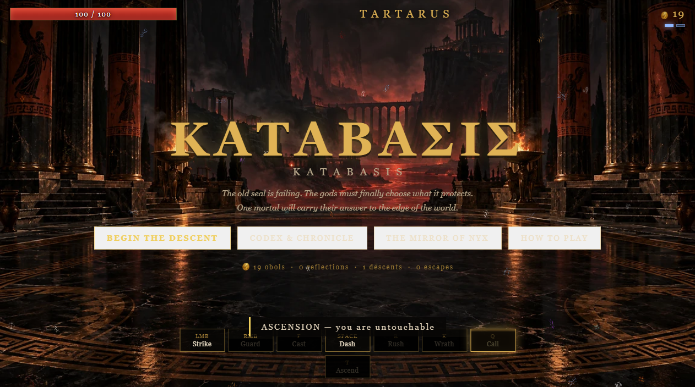

# ΚΑΤΑΒΑΣΙΣ — KATABASIS

**A roguelite set in Ancient Greece.** You are a mortal who has walked out of the House of
Hades. The Olympians take an interest as you climb through twenty-four regions—from Tartarus
and the River Styx to the Aegean crossing, the Gigantomachy front and the summit of Olympus.

A *katabasis* is a descent — into the underworld, and back out again.

The Divine Codex now holds **48 Greek deities**, including an Olympian Thirteen roster that counts both Hestia and Dionysus. Their painted portraits appear in divine audiences, calls, boon offers, and the Codex. Favor rises through boons, campaign choices, offerings, trials, and answered calls; refusing a god can sour the bond and strengthen a rival.

The bestiary adds **232 illustrated enemy families** across four painted atlases, with regional homes and fifteen combat roles. Chambers bring larger waves and can keep up to 22 enemies active together.

---

## Play it

Play in a browser, or use the portable Windows desktop app.

**Windows x64 app — `KATABASIS-1.0.0-win-x64-portable.exe`.** Download it from the
`KATABASIS-Windows-x64-portable` artifact on the latest successful run in the repository's
Actions tab. It runs without an installer and includes the game assets, so it works offline.
Keep the `KATABASIS Data` folder beside the executable to carry its save data with it. If the
app folder is read-only, saves fall back to this Windows account's app-data folder.
Browser progress and desktop-app progress use separate storage; existing browser saves are not
copied automatically.

To run the desktop app from source, install Node.js 24, then run `npm install` and `npm start`.
Build the Windows x64 executable with `npm run dist:win` on Windows.

The browser editions also work without installation.

**The single file — `katabasis.html`.** This is the one to send to someone. Styles, scripts,
and the complete generated image library are inlined, so it has no siblings and no
dependencies: open it from anywhere, offline, with no server. Drop it on a desktop, email
it, put it on a USB stick.

**The source tree — `index.html` + `css/` + `js/`.** Edit these. This is the real project;
`katabasis.html` is generated from it.

The score uses four supplied MP3s in `assets/audio/`, selected by region and adapted to
calm, combat, miniboss and boss intensity. The single-file build embeds the recordings for
offline play.

> If your browser is unusually strict about `file://` (some enterprise policies are), run
> any static server from this folder instead — `python -m http.server` then open
> <http://localhost:8000>. Nothing in the game requires it.

Rebuild the single file after any source change:

```
node tools/bundle.js
```

---

## Controls

| Input | Action |
|---|---|
| `W A S D` | Move |
| Mouse | Aim |
| **Left Click** (hold) | **Strike** — a three-hit combo, third hit deals +45% |
| **Right Click** (hold) | **Guard** — block, reflect, and parry |
| `F` | **Cast** — hurl a spear that bursts into a lingering rift |
| **Space** | **Dash** — charges, brief invulnerability; **dashing shatters petrification** |
| `R` | **Rush** — a long invulnerable charge that scatters a crowd |
| `K` | **Wrath** — a radial nova on a short cooldown |
| `Q` | **Call** — summon a god. Long cooldown, briefly slows time, you are invulnerable throughout |
| `T` | **Ascend** — five seconds of godhood |
| `E` | Interact / take / pass through a gate |
| **ESC** | Pause &nbsp;·&nbsp; `M` Mute |

There is also a full **How to Play** screen on the title menu, and a **Codex** that records
every god, boon, relic and creature as you meet them.

---

## The eight answers

Every ability answers a different problem, so the sheet is a small language rather than a
list of damage buttons.

**Strike** is your damage. **Guard** is your defence: raise it and blows from the front are
mostly stopped, and any *projectile* that touches it is reflected. Raise it at the instant of
impact and you **parry** — no damage at all, a stagger, and your next blows land 150% harder.
It is directional, so it does nothing for your back. **Cast** gives you reach. **Dash** is
your dodge, on charges. **Rush** is a long invulnerable charge for escaping a corner or
bowling through a pack. **Wrath** is the nova. **Call** brings a god down. **Ascend** is the
panic button: untouchable, faster, stronger, for five seconds.



Six of the original boons illustrate how the ability sheet deepens: *Bulwark of the Aegis*
(Athena) lengthens Guard, *Riposte* (Athena) strengthens a parry, *Hunter’s Cast* (Artemis)
empowers the rift, *Wing-Footed Charge* and *Afterimage* (Hermes) transform Rush, and
*Aegis of the Storm* (Zeus) extends Ascension and returns it sooner.

---

## How a run works

The campaign climbs through **24 regions**, each with eight chamber positions, for 192
main-path chambers. Six route decisions in each region shape room types, encounter
conditions, enemy squads, optional boss aspects and rewards; every region ends at its
own capstone.

- **Combat and challenge** — staged waves of mythological enemies. Clear them for a boon.
- **Champion chambers** — an elite champion supported by a larger minion group.
- **Charon’s shops** — spend obols on healing, permanent upgrades, relics and boons.
- **Treasure chambers** — fight through guardians and claim a relic.
- **Events** — take a healing offer or accept a risk for obols and a lasting effect.
- **Optional boss routes** — challenge a regional aspect for a greater reward.
- **Capstones** — defeat the region’s required boss to continue the ascent.

Clearing a chamber opens a gate. Passing through it collects its reward and advances the
run. Obols and the Mirror of Nyx persist through death.

### Progression and endgame

The 24-region descent is grouped into three acts of eight regions: Establish, Combine, and
Commit. The HUD tracks act, region, chamber, and the next milestone. The region 8 and 16
capstones add a separate Fated Thread draft after the normal boss boon and before the
campaign story. Choose one of three build-aware transformations; a run can keep two. Route
cards show danger, reward, encounter condition, threats, and any cost before you commit.

Persistent progression keeps its existing systems and unlocks, with bounded combat power.
Mirror ranks keep their current caps. Gear keeps its templates, rarity, affixes, and sets,
but level 30 is its final effective power level. New drops scale with depth; legacy items
above 30 stay in the Armory and use level 30 for effects, sale value, and upgrade limits.
The Loom has 42 spendable points across its six branches; once those points are spent or
banked, further Paragon XP does not add more points.

A full campaign victory unlocks Fated Trials. Select ranks 1–3 from eight Pacts before a
descent; the sum is the Pact Score (1–24). Pacts can strengthen or speed enemies, reduce
healing, raise shop prices, thin boon drafts, add elite pressure, or reduce starting Death
Defiance. Only a completed Trial improves the best score. One-time score rewards at 5, 10,
15, and 20 unlock titles shown in the Trial screen and victory recap. Trials add no
spendable currency or permanent combat stats. Existing campaign wins unlock Trials when an
older save is loaded.

---

## The mythology

The gods, heroes, monsters and places begin with Greek myth. Generated variants deepen those archetypes through combat traits, rewards and route conditions.

### The Twelve who watch

| God | Domain | What their boons do |
|---|---|---|
| ⚡ **Zeus** | Sky & Thunder | Chain lightning, thunder on dash, bolts that split and split again |
| 🔱 **Poseidon** | Sea & Earthquake | Waves that hurl foes, drowning damage-over-time, heavy knockback |
| 🦉 **Athena** | Wisdom & War | Damage reduction, shields, reflecting harm back at the attacker |
| 🗡 **Ares** | Bloodlust & Ruin | Bleed, **DOOM** (detonates after 1.2s), damage that grows as you near death |
| ❤ **Aphrodite** | Desire & Discord | WEAKEN, and **CHARM** — turn enemies against their own kin |
| 🏹 **Artemis** | The Hunt & the Moon | Critical strikes, homing arrows, piercing power shots |
| 🍇 **Dionysus** | Wine & Madness | Poison, staggering, clouds of noxious fumes |
| 🔨 **Hephaestus** | Forge & Flame | Armour, burning, magma left on the ground |
| 🪽 **Hermes** | Speed & Thievery | Attack speed, extra dashes, obols shaken loose from every hit |
| 🌾 **Demeter** | Grain & Winter | Chill, slow, rooting the field in ice, life from every chamber |
| 💀 **Hades** | The Dead & Riches | Shields from kills, wealth, and **Death Defiance** — one free resurrection |
| 🌀 **Chaos** | Primordial Nothing | Enormous power at a price. It always takes something first |

**8,460 boon definitions** fill the expanded catalog: 7,620 ordinary entries from 381 base
boon families and 840 special entries from 42 families. Each base entry has 19 generated
build-profile variants. The special families include 22 Duos and 20 Legendaries. Existing
IDs and original effects are preserved. The expansion adds 18 triggered mechanics,
36 total Fated Threads, 24 augments, and 18 automatic synergies. The Codex Builds tab
shows synergy requirements and exact effects; its build-power filter finds relevant boons.
Each power states its trigger, radius or timing rule, and stacking cap.

**366 relic definitions** include the 18 original relic families with distinct stat profiles
and six special relic transformations, while retaining their family artwork.

### The bestiary (256 families, 5,120 fightable definitions, plus 2 summons)

Shades that refused the ferryman · Skeleton Hoplites buried with their shields · Harpies ·
Bloodlings born from spilled ichor · Cerberus whelps with three heads · Wailing Souls ·
Marsh Naiads · Satyrs of Dionysus' retinue, gone feral · Centaur Raiders who shoot behind
them as they gallop · **Gorgons**, whose gaze turns you to stone (dash to shatter it) ·
the **Minotaur**, Asterion, charging in straight honest lines · Cyclops Smiths who throw
what they are holding · Bronze Automatons whose shields turn arrows · Telkhines, the
flipper-handed smiths of Rhodes · the **Furies** · Styxlings · Empusa, Hecate's attendant ·
a hundred-handed **Hecatoncheir** · Lamia · Gigas born of Gaia's blood · Typhon-spawn ·
the Eidolon of a Hero who still remembers its footwork.

### Bosses and aspects

| | |
|---|---|
| **The Nemean Lion** | The hide no blade bites. Herakles strangled it; you are not Herakles. |
| **Medusa** | Do not meet her eyes. Three escalating phases, and the snakes detach. |
| **The Lernaean Hydra** | Nine heads. Cut one, and brace. |
| **Typhon** | The last son of Gaia. A hundred dragon heads and a storm where a body should be. Four phases. |

The original four bosses retain their named phases. Eight named capstones cover the earlier
regions; Acheron’s Keeper, Mnemosyne, the Crowned Minotaur, Circe, the Colchian Dragon
and Typhon’s Heart add six more regional capstones. Seventeen generated aspects for each
original boss bring the full roster to 86 boss definitions.

### Gods you can call

`Q` summons whichever Olympian favours you most, each with a fully distinct effect: Zeus
hurls bolts at every foe at once; Poseidon's tidal wall scatters the room; Athena makes you
untouchable and turns every projectile around; Ares calls a storm of blades; Aphrodite
charms the entire chamber into fighting itself; Artemis pours seeking arrows from the sky;
Dionysus staggers everything senseless; Hephaestus drops anvils; Hermes makes you blindingly
fast; Demeter roots the field in ice; Hades sends the dead to fight beside you; Chaos simply
gnaws at everything that lives.

---

## The Mirror of Nyx

Permanent progression, bought with obols that survive death. Sixteen reflections, 52 ranks
in total, two to five ranks each — Toughness, Striking Power, Swiftness, Sharpened Edge,
Thick Skin, Gods' Charm, Greed, Windfoot, Wrathful, **Death's Mercy** (extra resurrections),
Insight (extra rerolls and boon choices), Tithe of the Dead, Chthonic Bargain, Fury,
Styx-Touched, and **Fated** — which starts every run with a random relic.

A **Codex** records every boon, relic, god and creature you have encountered, and marks the
ones you have not.

---

## Architecture

Plain ES5-flavoured JavaScript, no modules, no transpiler, no runtime dependencies. Load
order is explicit in `index.html`, and `tools/bundle.js` inlines the source and every
optimized image into `katabasis.html`.

```
index.html          markup, HUD, and every menu screen
css/style.css       black-figure pottery styling
js/core.js          RNG, math, input, camera, particles, save normalization,
                    and a fully procedural Web Audio score (modal Greek scales,
                    frame drums, lyre arpeggios — no sound files)
js/data.js          base records for 12 gods, 93 boons, 18 relics, 16 meta upgrades,
                    4 regions, 24 enemies and 4 bosses
js/content-expansion.js  20× catalogs, boss aspects, new capstones, regions, routes,
                         chamber conditions and events
js/entities.js      Player and its eight abilities, Enemy (15 AI archetypes),
                    Boss, Ally, Projectile, Pickup, hazards and effects
js/game.js          the run director: chambers, spawning, the stat compiler,
                    damage resolution, boon economy, every god effect
js/asset-manifest.js generated atlas dimensions and image paths
js/assets.js        image preloader, atlas drawing, sprite animation and UI image helpers
js/render.js        image-based visual layer: region scenes, actors, bosses, VFX, banners
js/main.js          boot, resize, the fixed-step loop, all menus and HUD wiring
assets/             PNG source art and optimized WebP atlases used by the game
```

Plus `katabasis.html`, the generated single-file edition, and `tools/` (the bundler and the
five verification harnesses).

A few notes on how it is put together:

- **Boons are pure data.** Each boon is an `fx` object of declarative keys
  (`dmgMul`, `chain`, `doomOnHit`, `dashShield`, `fogOnKill`, …). `compileStats()` folds
  every boon, relic, meta upgrade and shop purchase into one flat stat block that is
  recomputed whenever the build changes. Adding a new boon is adding one object to
  `data.js` — no engine changes.
- **Enemies are data plus an AI archetype.** Each bestiary entry names a behaviour
  (`charger`, `diver`, `petrifier`, `brute`, `kiter`, `summoner`, `exploder`, `duelist`,
  `hundred`, …) and its numbers. The archetype owns the tell, the danger, and the opening.
- **All scene artwork is image-based.** Generated, transparent sprite atlases supply the
  player, every creature and boss, animated combat effects, projectiles, status effects,
  region backdrops and floors, environmental props, god portraits, relics and interface
  textures. The canvas positions, crops, fades and animates these images; it does not draw
  geometric artwork for the game world.
- **The art source files stay editable.** PNG masters are retained in `assets/`; the
  manifest points the runtime at optimized WebP atlases and lazy-loaded animation sheets.
  `tools/build-animation-atlases.js --pack` registers reviewed transparent sprite sheets
  without resampling. Each sheet declares its own grid, with a 256-pixel minimum frame edge.
  `tools/bundle.js` streams the image and audio payloads into the standalone file.
- **Audio is synthesised at runtime.** No assets. Each region has its own modal track
  (Phrygian for Tartarus and the Forge, Dorian for Asphodel, Lydian for Olympus) with a
  drone, a pad, a lyre arpeggio and frame drums.

---

## Verification

For the expanded revision and extensive debug pass:

- `node tools/verify-expansion.js` runs 16 automated suites covering combat, progression,
  saves, the full catalogue, build interactions, image loading and authored animation fallback.
- `node tools/ui-browser.js` checks 16 interface scenarios across desktop, tablet and narrow screens.
- `node tools/extensive-browser.js` checks all 18 new powers through reward cards, all
  18 hero/weapon restart cycles, large-save reload and 12 extended browser combat sessions.
- `node tools/bundle.js` builds `katabasis.html` as a self-contained offline file.
  `node tools/offline-browser.js` verifies that file with networking disabled and records
  simulation-plus-draw CPU timings on the local machine.
- Every runtime image entry is raster art; all referenced files are present in `assets/`.
- The catalogue retains 24 regions, 192 chambers and 144 route decisions. The new boon
  and build expansion triples 2,820 offers to 8,460 and preserves the original definitions.

Projectile bonuses now produce their advertised damage multiplier. Calls, generated
attacks and their delayed statuses preserve proc attribution, and enemy self-destruction
cannot grant player kill powers. Ordinary player-applied damaging statuses still qualify.
Authored enemy animations use one sprite without an overlapping fallback. CSS art URLs
resolve against the game document, and image readiness waits for asynchronous decoding.
The large offline art bundle can still cause a cold first-render hitch; measured limits
and verification evidence accompany the delivered release.

---

## Screenshots

These reference captures predate the expanded campaign and do not show the new regional or boss art. They remain in tools/.

| | |
|---|---|
|  | The House of Hades |
|  | Guard raised, Ascend burning |
|  | Tartarus |
|  | Asphodel |
|  | The Bronze Forge |
|  | The Summit |

---

## Tips for the descent

1. **Guard is a read, not a wall.** Holding it only stops 78% of a frontal hit and drains
   your tempo — but raising it *at the instant* something lands is a full parry that also
   staggers and empowers you. Learn the tells, then parry them.
2. **Dash is your defence, not your travel.** Its invulnerability window is the answer to
   almost every telegraphed attack in the game. Rush is the long version, for when you need
   to leave a room entirely.
3. **Concentrate your boons.** One god at rank 3 unlocks their Legendary; scattering across
   six gods unlocks nothing.
4. **Ares + Aphrodite is a trap for enemies, not for you.** Bleed plus Weaken is the highest
   sustained damage in the game, and *Curse of Longing* doubles it.
5. **Buy Death's Mercy early.** The Mirror's resurrection ranks are worth more than any
   damage stat when you are still learning the bosses.
6. **Refusing the gods is a real choice.** The skip button trades a boon for obols and
   maximum life — a legitimate path when the offered boons do not fit your build.
7. **Against Medusa, turn your back.** Walk away from the gaze and dash when the cone
   locks on. Petrifaction is not fatal; being petrified in front of a charging Minotaur is.
8. **Save Ascend for the turn.** Five seconds of godhood is the difference between a chamber
   going wrong and a chamber going right. It is a 30-second cooldown; spend it on purpose.


## Expanded campaign

The expanded game has 8,460 boons, 366 relics, 5,120 fightable enemy definitions plus
two summoned allies, 92 boss definitions, and a twenty-four-region campaign of eight
chambers per region (192 main-path chambers). Boons comprise 381 ordinary families
and 42 special families, each with twenty build profiles. Painted enemy families and
their stat profiles retain the existing art, boss stages, and regional capstones.

Six route decisions per region vary room types, conditions, enemy squads, optional boss
aspects and rewards. Their route-signature lower bound is 2^108.

Capstone conversations play as image-led cutscenes over each region’s raster backdrop.
Character sprite sheets animate per speaker; Enter, Space, or Right advances the dialogue,
Escape skips to the decision, and every scene still ends with its campaign choice. Player and enemy art is
larger while collision radii stay unchanged; combat queues later groups and caps active
hostiles at 14. The searchable Codex renders 48 entries per page, and existing local Save
and Mirror fields are retained.

All runtime asset entries are raster images, including lazy-loaded enemy animation sheets. Generated PNG masters remain editable,
and optimized WebP atlases are bundled for offline play. The last source build produced
a single HTML file with zero external references.

## Progress storage and quality pass (2026-09-30)

Progress now uses IndexedDB when available, with automatic migration of your existing localStorage save. The older save is retained for recovery. The source and standalone editions in the same folder share the new progress database. Browser data remains local to that browser profile and folder; moving the game does not transfer progress automatically. If durable storage is unavailable, localStorage is used, and failed writes display a persistent warning with Retry Save and Download Backup. Closing with pending or failed writes prompts you to keep the page open.

The Armory and Loom remain persistent. Gear power is capped at level 30 while legacy item levels remain recorded. Equipment swaps preserve health percentage and cannot refill spent revivals. Weapon damage, reach affixes and shield nodes now affect their advertised combat stats. Keyboard Tab navigation works in menus, typing in search does not trigger combat shortcuts, and losing focus pauses live combat.

Additional verification: `node tools/debug-regressions.js`, `node tools/quality-regressions.js`, `node tools/debug-campaign.js`, `node tools/debug-content.js`, and `node tools/quality-browser.js`. See `QUALITY-REPORT.md` for measured results and limits.
